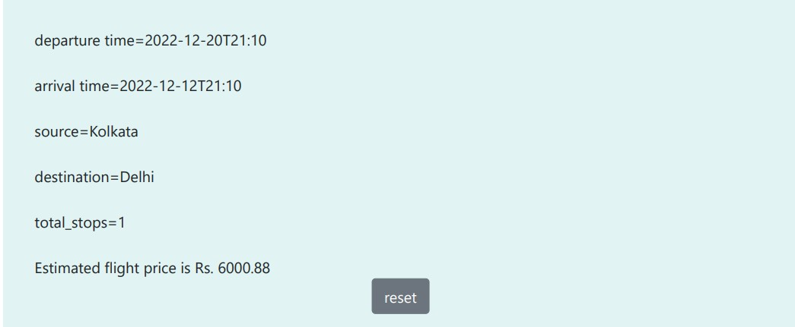

# Flight Price Estimation Project

This project estimates flight prices based on various factors such as departure time, arrival time, source, destination, number of stops, and the airline name. It aims to provide users with an estimation of flight prices based on these factors, allowing them to make informed decisions when planning their air travel. By considering the departure time, arrival time, source, destination, number of stops, and the specific airline operating the flight, the project seeks to provide accurate and tailored price estimations for a wide range of flight options. Users can input these parameters and obtain an estimated price, helping them plan their travel budgets effectively. The project utilizes libraries such as numpy, pandas, matplotlib.pyplot, and seaborn for data analysis and visualization to support the flight price estimation process.


### To set up the project and run the Flask app, follow these steps:

1. Create a virtual environment (optional but recommended) to isolate the project's dependencies. Open a terminal or command prompt and navigate to the project directory.


```bash
# Create a virtual environment
virtualenv env
```

Activate the virtual environment:

For Windows:

```bash
env\Scripts\activate
```

For macOS/Linux:

```bash
source env/bin/activate
```

Install the project dependencies by running the following command:

```bash
python app.py
```


## 

The following screenshots demonstrate the usage of the flight price estimation app. They showcase how users can input the required parameters, such as departure time, arrival time, source, destination, number of stops, and airline name, and obtain an estimated flight price. These screenshots provide a visual representation of the app's interface and illustrate the process of estimating flight prices based on different inputs. 




